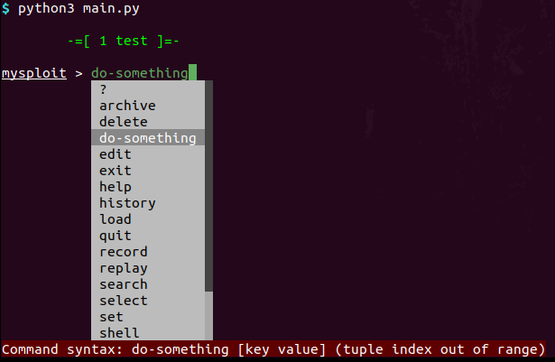

[](https://pypi.python.org/pypi/sploitkit/)
[](https://sploitkit.readthedocs.io/en/latest/?badge=latest)
[](https://snyk.io/test/github/dhondta/sploitkit?targetFile=requirements.txt)
[](https://requires.io/github/dhondta/sploitkit/requirements/?branch=master)
[](https://pypi.python.org/pypi/sploitkit/)
[](https://pypi.python.org/pypi/sploitkit/)
[](https://beerpay.io/dhondta/sploitkit)
[](https://www.paypal.me/dhondta)


# SploitKit

This toolkit is aimed to easilly build framework consoles in a Metasploit-like style. It provides a comprehensive interface to define CLI commands, modules and models for its storage database.

## Quick Start

### Setup

```
pip install sploitkit
```

### Create a project

```sh
$ sploitkit-new my-sploit
$ cd my-sploit
$ gedit main.py
```

### Usage

From this point, `main.py` has the following code:

```python
#!/usr/bin/python3
from sploitkit import FrameworkConsole


class MySploitConsole(FrameworkConsole):
    # set your console items here
    pass


if __name__ == '__main__':
    MySploitConsole(
        "MySploit",
        # configure your console settings here
    ).start()
```

And you can run it from the terminal:



### Base features

Sploitkit provides a base set of entities (consoles, commands, modules, models).

Multiple base console levels already exist (for detailed descriptions, see [the console section](../console/index.html)):

- [`FrameworkConsole`](https://github.com/dhondta/sploitkit/blob/master/sploitkit/core/console.py): the root console, started through `main.py`
- [`ProjectConsole`](https://github.com/dhondta/sploitkit/blob/master/sploitkit/base/commands/project.py): the project console, for limiting the workspace to a single project, invoked through the `select [project]` command
- [`ModuleConsole`](https://github.com/dhondta/sploitkit/blob/master/sploitkit/base/commands/module.py): the module console, started when a module is invoked through the `use [module]` command

This framework provides more than 20 base commands, distributed in sets of functionalities (for detailed descriptions, see [the command section](../command/index.html)):

- [*general*](https://github.com/dhondta/sploitkit/blob/master/sploitkit/base/commands/general.py): commands for every level (e.g. `help`, `show`, `set`)
- [*module*](https://github.com/dhondta/sploitkit/blob/master/sploitkit/base/commands/module.py): base module-level commands (e.g. `use`, `run`, `show`)
- [*project*](https://github.com/dhondta/sploitkit/blob/master/sploitkit/base/commands/project.py): base project-level commands (e.g. `select`, `load`, `archive`)
- [*recording*](https://github.com/dhondta/sploitkit/blob/master/sploitkit/base/commands/recording.py): recording commands, for managing `.rc` files (`record`, `replay`)
- [*root*](https://github.com/dhondta/sploitkit/blob/master/sploitkit/base/commands/root.py): base root-level commands (`help`)
- [*utils*](https://github.com/dhondta/sploitkit/blob/master/sploitkit/base/commands/utils.py): utility commands (`shell`, `pydbg`, `memory`)

It also holds some base models for its storage:

- [*users*](https://github.com/dhondta/sploitkit/blob/master/sploitkit/base/models/notes.py): for user-related data (`User`, `Email`, `Password`)
- [*systems*](https://github.com/dhondta/sploitkit/blob/master/sploitkit/base/models/systems.py): for system-related data (`Host`, `Port`, `Service`)
- [*organization*](https://github.com/dhondta/sploitkit/blob/master/sploitkit/base/models/organization.py): for organization-related data (`Organization`, `Unit`, `Employee`)
- [*notes*](https://github.com/dhondta/sploitkit/blob/master/sploitkit/base/models/notes.py): for linking notes to users, hosts or organizations

No module is provided with the framework as it is case-specific.

### Customization

Sploitkit defines multiple types of entities for various purposes. The following entities can be subclassed:

- [`Console`](https://github.com/dhondta/sploitkit/blob/master/sploitkit/core/console.py): a new console for a new level of interaction (e.g. [`ProjectConsole`](https://github.com/dhondta/sploitkit/blob/master/sploitkit/base/commands/project.py)) ; the "`root`" level is owned by the [`FrameworkConsole`](https://github.com/dhondta/sploitkit/blob/master/sploitkit/core/console.py), [`Console`](https://github.com/dhondta/sploitkit/blob/master/sploitkit/core/console.py) shall be used to create new subconsoles, to be called by commands from the root console (see an example [here](https://github.com/dhondta/sploitkit/blob/master/sploitkit/base/commands/module.py) for the module-level commands with [`ModuleConsole(Console)` and `Use(Command)`](https://github.com/dhondta/sploitkit/blob/master/sploitkit/base/commands/module.py))
- [`Command`](https://github.com/dhondta/sploitkit/blob/master/sploitkit/core/command.py): a new command associated with any or defined consoles using the `level` attribute
- [`Module`](https://github.com/dhondta/sploitkit/blob/master/sploitkit/core/module.py): a new module associated to a console
- [`Model`, `BaseModel`, `StoreExtension`](https://github.com/dhondta/sploitkit/blob/master/sploitkit/core/model.py): respectively for new models, their association tables and store additional methods (e.g. [`User(Model)`, `Email(Model)`, `UserEmail(BaseModel)`, `UsersStorage(StoreExtension)`](https://github.com/dhondta/sploitkit/blob/master/sploitkit/base/models/users.py))
