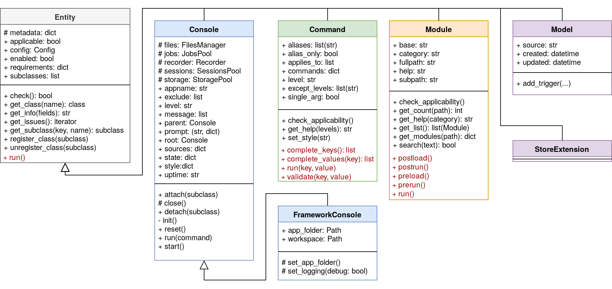

The following figure depicts the class hierarchy implementing the aforementioned design :

On this figure, one can see the main attributes and methods that can be used (in black) or overridden (in red).
