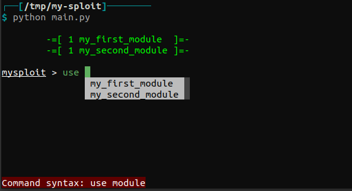

## Introduction

Sploitkit is a development kit designed to quickly build CLI consoles with a style resembling that of Metasploit. It features a clear and intuitive plugin architecture that allows to build consoles with new commands or modules but also models for their internal stores. The framework is built with the DRY philosophy in mind.

The idea is to make creating consoles as easy as this:

```sh
$ sploitkit my-sploit
$ cd my-sploit
$ gedit main.py
```

```python
#!/usr/bin/python3
from sploitkit import FrameworkConsole
from tinyscript import *


class MySploitConsole(FrameworkConsole):
    #TODO: set your console attributes
    pass


if __name__ == '__main__':
    parser.add_argument("-d", "--dev", action="store_true", help="enable development mode")
    parser.add_argument("-r", "--rcfile", type=ts.file_exists, help="execute commands from a rcfile")
    initialize()
    c = MySploitConsole(
        "MySploit",
        #TODO: configure your console settings
        dev=args.dev,
    )
    c.rcfile(args.rcfile) if args.rcfile else c.start()
```

This will give the following (no banner, ASCII image or quote yet):



-----

## Setup

This library is available on [PyPi](https://pypi.python.org/pypi/sploitkit/) and can be simply installed using Pip:

```sh
pip install sploitkit
```

-----

## Rationale

This library is born from the need of quickly building toolsets tailored to various scopes which are sometimes not extensively covered in some well-known frameworks (like Metasploit).

It relies on the awesome Python library [`prompt_toolkit`](https://github.com/prompt-toolkit/python-prompt-toolkit) to provide an enhanced CLI environment, adding multiple graphical elements (e.g. dropdown lists for completion and a dynamic toolbar for displaying command syntax errors) greatly improving user's experience regarding some classical tools (like e.g. or also [`rpl-attacks`](https://github.com/dhondta/rpl-attacks) or [`recon-ng`](https://github.com/lanmaster53/recon-ng), which have some limits on the usability point of view because of the [`cmd` module](https://docs.python.org/3/library/cmd.html)).

I personally use this library to create CLI consoles for my job or during cybersecurity engagements or programming competitions and it proved very useful and convenient.
